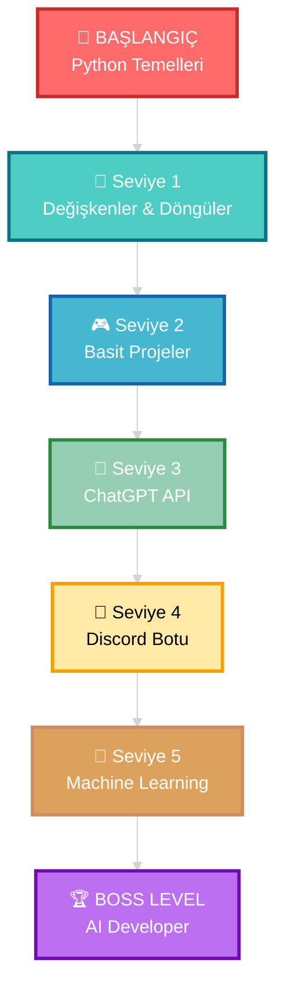

<div align="center">


</div>

<div align="center">
  
#  Hoş Geldin!


<br/>

[](https://www.youtube.com/channel/UCbRYSI8ZHXAZpfIO6qkAipA)
[](mailto:huseynovomer955@gmail.com)
[](https://discord.com)


</div>

<br/>


<br/>

<table>
<tr>
<td width="50%" valign="top">

## 🚀 Hakkımda

```python
class KodSavaşçısı:
    def __init__(self):
        self.isim = "Ömer Hüseynov"
        self.yas = 13
        self.konum = "Baku, Azerbaijan 🇦🇿"
        self.diller = ["Türkçe", "Azeri"]
        self.durum = "Öğreniyorum 📚"
        self.hedef = "AI Developer 🤖"
        self.motto = "Kod yaz, hata al, öğren! 💪"
    
    def gunluk_rutin(self):
        aktiviteler = [
            "☕ Kahvaltı",
            "💻 Python Pratik",
            "📹 YouTube İçerik Hazırla",
            "🎮 Projeler Üzerinde Çalış",
            "📚 Yeni Şeyler Öğren",
            "🌙 Uyku (kodlama rüyaları)"
        ]
        return aktiviteler
    
    def yetenekler(self):
        return {
            "Kodlama": "🟢 Başlangıç",
            "Problem Çözme": "🟡 Gelişiyor",
            "Öğrenme Hızı": "🟢 Yüksek",
            "Motivasyon": "🟢 Maksimum"
        }

# Kod yolculuğum başladı! 🚀
ben = KodSavaşçısı()
print(f"Selam! Ben {ben.isim}!")
```

</td>
<td width="50%" valign="top">

## 💫 Hızlı Bilgiler


🎓 **13 yaşında** kod öğreniyorum  
🌱 **Python** ile başladım  
🎥 **YouTuber** olmaya çalışıyorum  
🎯 **Hedefim:** AI projeleri yapmak  
⚡ **Gerçek:** Henüz yeni başladım!  
💭 **İnaç:** Her uzman acemiydi  
🔥 **Motivasyon:** %100 şarjda  
🎮 **Hobiler:** Oyun, Kod, Video çekme

<br/>

### 📊 Kod Seviyem

```text
Python        ████░░░░░░   40%
JavaScript    ██░░░░░░░░   20%
HTML/CSS      ███░░░░░░░   30%
Git/GitHub    ███░░░░░░░   30%
Problem Çöz.  ████░░░░░░   40%
```

</td>
</tr>
</table>

<br/>


<br/>

## 📚 Öğrenme Yol Haritam

<div align="center">



<br/>

### 🎯 Şu An Bulunduğum Yer: **Seviye 1-2 Arası** 🚀

</div>

<br/>


<br/>

## 🛠️ Teknoloji Yığınım

<div align="center">

### 💻 Kullandıklarım

<table>
<tr>
<td align="center" width="96">

<br>Python
</td>
<td align="center" width="96">

<br>JavaScript
</td>
<td align="center" width="96">

<br>HTML5
</td>
<td align="center" width="96">

<br>CSS3
</td>
<td align="center" width="96">

<br>VS Code
</td>
<td align="center" width="96">

<br>Git
</td>
<td align="center" width="96">

<br>GitHub
</td>
<td align="center" width="96">

<br>Replit
</td>
</tr>
</table>

### 🎯 Öğrenmeyi Planlıyorum

<table>
<tr>
<td align="center" width="96">

<br>Discord.py
</td>
<td align="center" width="96">

<br>TensorFlow
</td>
<td align="center" width="96">

<br>React
</td>
<td align="center" width="96">

<br>Node.js
</td>
<td align="center" width="96">

<br>PostgreSQL
</td>
<td align="center" width="96">

<br>Docker
</td>
<td align="center" width="96">

<br>Firebase
</td>
<td align="center" width="96">

<br>ChatGPT
</td>
</tr>
</table>

</div>

<br/>


<br/>

## 📊 GitHub İstatistiklerim

<div align="center">
  


</div>

<div align="center">
  
  
</div>

<br/>

<div align="center">
  
</div>

<br/>

<div align="center">
  
</div>

<br/>


<br/>

## 🎯 2025 Hedeflerim

<div align="center">

<table>
<tr>
<td width="33%" align="center">

### 📚 Öğrenme
- ✅ Python Temelleri
- 🔄 Döngüler & Fonksiyonlar
- ⏳ OOP Kavramları
- ⏳ Veri Yapıları
- ⏳ Algoritmalar

</td>
<td width="33%" align="center">

### 💻 Projeler
- ⏳ İlk Basit Proje
- ⏳ Hesap Makinesi
- ⏳ To-Do List App
- ⏳ Discord Bot
- ⏳ ChatGPT Entegrasyonu

</td>
<td width="33%" align="center">

### 🎥 YouTube
- ✅ Kanal Oluşturma
- 🔄 İlk Videolar
- ⏳ 100 Abone
- ⏳ 500 Abone
- ⏳ 1000 Abone

</td>
</tr>
</table>

</div>

<br/>


<br/>

## 💡 İlk Kodlarım

<div align="center">

### 🎉 İşte Başlangıç!

</div>

<details>
<summary>🌍 Hello World - Her Şey Buradan Başladı!</summary>

```python
# İlk kodum! 🚀
print("Merhaba Dünya! 🌍")
print("Ben Ömer ve kodlamayı öğreniyorum!")
print("Bu yolculuk çok heyecan verici! 💪")
```

**Yazdığım tarih:** Ocak 2025  
**Hislerim:** Çok heyecanlıydım! İlk kodumu çalıştırdığımda kendimi süper hissettim! 🎉

</details>

<details>
<summary>🎨 Renkli Çıktı - Biraz Daha Eğlenceli!</summary>

```python
# Terminal'de renkli yazılar! 🌈
print("\033[91m❤️ Kırmızı Yazı")
print("\033[92m💚 Yeşil Yazı")
print("\033[93m💛 Sarı Yazı")
print("\033[94m💙 Mavi Yazı")
print("\033[95m💜 Mor Yazı")
print("\033[0m✨ Normal Yazı")
```

**Ne öğrendim:** ANSI renk kodlarını keşfettim!

</details>

<details>
<summary>🎲 Sayı Tahmin Oyunu - İlk Gerçek Projem!</summary>

```python
import random

print("🎮 SAYI TAHMİN OYUNU 🎮")
print("=" * 30)

sayi = random.randint(1, 100)
deneme = 0
max_deneme = 10

print(f"1 ile 100 arasında bir sayı tuttum!")
print(f"Toplam {max_deneme} hakkın var!\n")

while deneme < max_deneme:
    tahmin = int(input(f"Tahmin {deneme + 1}/{max_deneme}: "))
    deneme += 1
    
    if tahmin < sayi:
        print("⬆️  Daha yüksek bir sayı söyle!")
    elif tahmin > sayi:
        print("⬇️  Daha düşük bir sayı söyle!")
    else:
        print(f"\n🎉 TEBRİKLER! {deneme} denemede bildin!")
        print(f"🏆 Sayı {sayi} idi!")
        break
else:
    print(f"\n😢 Üzgünüm, hakkın bitti!")
    print(f"🔢 Sayı {sayi} idi!")

print("\n✨ Oynadığın için teşekkürler!")
```

**Zorluk:** While döngüsü ve if-else mantığını anlamak zaman aldı ama başardım! 💪

</details>

<details>
<summary>🧮 Basit Hesap Makinesi - Fonksiyonları Öğrendim!</summary>

```python
def topla(a, b):
    return a + b

def cikar(a, b):
    return a - b

def carp(a, b):
    return a * b

def bol(a, b):
    if b == 0:
        return "❌ Sıfıra bölünemez!"
    return a / b

print("🧮 HESAP MAKİNESİ 🧮")
print("=" * 30)
print("1. Toplama (+)")
print("2. Çıkarma (-)")
print("3. Çarpma (*)")
print("4. Bölme (/)")

secim = input("\nİşlem seç (1-4): ")
sayi1 = float(input("İlk sayı: "))
sayi2 = float(input("İkinci sayı: "))

if secim == '1':
    print(f"\n✅ Sonuç: {topla(sayi1, sayi2)}")
elif secim == '2':
    print(f"\n✅ Sonuç: {cikar(sayi1, sayi2)}")
elif secim == '3':
    print(f"\n✅ Sonuç: {carp(sayi1, sayi2)}")
elif secim == '4':
    print(f"\n✅ Sonuç: {bol(sayi1, sayi2)}")
else:
    print("\n❌ Geçersiz seçim!")
```

**Başarı:** İlk kez fonksiyon yazdım! Kodlarım daha düzenli görünüyor! 🎯

</details>

<br/>


<br/>

## 📺 YouTube Yolculuğum

<div align="center">

<a href="https://www.youtube.com/channel/UCbRYSI8ZHXAZpfIO6qkAipA">
  
</a>

<br/><br/>

### 🎬 İçerik Planım

| 📹 Video Türü | 📝 Açıklama | ✅ Durum |
|:---:|:---|:---:|
| 🚀 Başlangıç | Python'a nasıl başladım | Planlıyor |
| 💻 Kod Along | Benimle birlikte kod yaz | Planlıyor |
| 🐛 Hata Çözümleri | Yaptığım hatalar ve çözümler | Planlıyor |
| 🎮 Proje Videoları | Yaptığım projeleri gösterme | Planlıyor |
| 🤖 AI Keşifleri | ChatGPT ve AI araçları | Planlıyor |

### 💭 *"Her video, öğrenme yolculuğumun bir parçası!"*

</div>

<br/>


<br/>

## 🌟 İlham Verici Sözler

<div align="center">

<table>
<tr>
<td>

### 💡 Beni Motive Edenler

> *"The only way to learn a new programming language is by writing programs in it."*  
> **— Dennis Ritchie**

> *"Code is like humor. When you have to explain it, it's bad."*  
> **— Cory House**

> *"First, solve the problem. Then, write the code."*  
> **— John Johnson**

> *"The best error message is the one that never shows up."*  
> **— Thomas Fuchs**

</td>
<td>

### 🎯 Benim Mottoм

```python
while True:
    kod_yaz()
    hata_al()
    ogren()
    
    if basarili():
        kutla()
    else:
        yeniden_dene()
    
    # Asla vazgeçme! 💪
```

**🔥 İnanç:**  
Her hata, bir öğrenme fırsatıdır!  
Her başarısız deneme, başarıya bir adım daha yaklaşmaktır!

</td>
</tr>
</table>

</div>

<br/>


<br/>

## 📫 Benimle İletişime Geç!

<div align="center">

### 🤝 Birlikte Öğrenelim!

<table>
<tr>
<td align="center" width="200">
<a href="https://www.youtube.com/channel/UCbRYSI8ZHXAZpfIO6qkAipA">
<br/>
<b>YouTube</b><br/>
<sub>Videoları izle</sub>
</a>
</td>
<td align="center" width="200">
<a href="mailto:huseynovomer955@gmail.com">
<br/>
<b>Gmail</b><br/>
<sub>Email gönder</sub>
</a>
</td>
<td align="center" width="200">
<a href="https://discord.com">
<br/>
<b>Discord</b><br/>
<sub>Sohbet et</sub>
</a>
</td>
<td align="center" width="200">
<a href="https://github.com/Lukosadev1">
<br/>
<b>GitHub</b><br/>
<sub>Kodları incele</sub>
</a>
</td>
</tr>
</table>

<br/>

### 💬 Mesaj Gönder

[](https://www.youtube.com/channel/UCbRYSI8ZHXAZpfIO6qkAipA)
[](mailto:huseynovomer955@gmail.com)
[](https://discord.com)

<br/>

**💡 Soru, öneri veya sadece sohbet için her zaman açığım!**

</div>

<br/>


<br/>

<div align="center">

## 🎓 Öğrenme Kaynaklarım

*Eğer sen de öğreniyorsan, bunlar çok işime yarıyor:*

[](https://python.org)
[](https://w3schools.com)
[](https://developer.mozilla.org)
[](https://stackoverflow.com)
[](https://chat.openai.com)
[](https://youtube.com)

</div>

<br/>


<br/>

<div align="center">

## 🌈 Yolculuğuma Katıl!


### ✨ *Henüz başlangıçtayım ama azimle devam ediyorum!*

**13 yaşında, sınırsız potansiyelle! 🚀**

<br/>

### 📈 İstatistikler


<br/>

### 🎯 Son Güncelleme: Ocak 2025

**⭐ Bu profili beğendiysen yıldız vermeyi unutma!**  
**🔔 Takip et ve yolculuğumu izle!**

<br/>

---

<sub>💖 Sevgiyle kodlanmıştır | 🚀 Yapımda: Ömer Hüseynov | ⚡ Sürekli Gelişiyor</sub>

</div>


