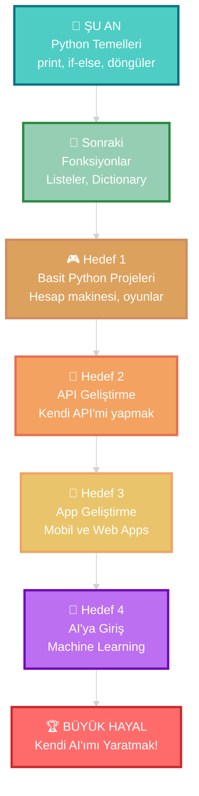

<div align="center">


</div>

<div align="center">
  
#  Selam!


<br/>

[](https://www.youtube.com/channel/UCbRYSI8ZHXAZpfIO6qkAipA)
[](mailto:huseynovomer955@gmail.com)
[](https://discord.com)


</div>

<br/>


<br/>

<table>
<tr>
<td width="50%" valign="top">

## 🚀 Benim Hakkımda

```python
# Dürüstçe söyleyeyim, henüz yeni başladım!

isim = "Ömer Hüseynov"
yas = 13
konum = "Bakü, Azerbaycan 🇦🇿"
seviye = "Yeni Başlayan (Acemi)"

# Şu anki durumum
python_seviyem = "Temel şeyler öğreniyorum"
js_bilgim = "Henüz çok az biliyorum"
ne_yapabiliyorum = [
    "print() komutu",
    "Basit değişkenler",
    "if-else (bazen karıştırıyorum)",
    "Döngüler (öğrenmeye çalışıyorum)"
]

# En büyük hayallerim
hedeflerim = [
    "Kendi yapay zekamı yaratmak! 🤖",
    "Kendi API'mi yapmak 🔗",
    "Mobil app geliştirmek 📱",
    "Web app'leri yapmak 🌐"
]

# Gerçekten yapmak istediklerim
isteklerim = [
    "AI geliştirici olmak",
    "Kendi AI'ımı kodlamak",
    "ChatGPT gibi bir şey yapmak",
    "Kendi API'mi yaratıp paylaşmak",
    "Kendi mobil uygulamamı yapmak",
    "Machine Learning öğrenmek"
]

print("Yeni başladım ama çok hevesliyim! 💪")
```

</td>
<td width="50%" valign="top">

## 💫 Gerçek Bilgiler


🎓 **13 yaşında** kod öğrenmeye başladım  
🐣 **Çok yeniyim** - Python'da temel seviye  
🎥 **YouTube'da** içerik yapmaya çalışıyorum  
🎯 **Büyük hayallerim:**
   - 🤖 AI Developer olmak
   - 🔗 Kendi API'mi yapmak
   - 📱 Mobil app geliştirmek
   - 🌐 Web uygulamaları yapmak  
⚡ **Gerçek:** Henüz çok şey bilmiyorum ama öğreniyorum  
💭 **İnanç:** Herkes bir yerden başladı!  
🔥 **Motivasyon:** %1000 ama bilgi az 😅  
📚 **Şu an:** Temelleri öğrenmeye çalışıyorum

<br/>

### 📊 Dürüst Seviye Göstergem

```text
Python         ██░░░░░░░░   15% (Yeni başladım)
JavaScript     █░░░░░░░░░   5%  (Çok az biliyorum)
HTML/CSS       ██░░░░░░░░   20% (Basit şeyler)
AI/ML          ░░░░░░░░░░   0%  (Öğreneceğim!)
Git/GitHub     █░░░░░░░░░   10% (Öğreniyorum)
```

</td>
</tr>
</table>

<br/>


<br/>

## 📚 Öğrenme Yolculuğum

<div align="center">



<br/>

### 🎯 Şu Anki Konumum: **Yeni başladım, Python temelleri öğreniyorum** 🌱

</div>

<br/>


<br/>

## 🛠️ Ne Kullanıyorum / Öğreneceğim

<div align="center">

### 💻 Şu An Kullandıklarım (Yeni Öğreniyorum)

<table>
<tr>
<td align="center" width="96">

<br>Python<br><sub>Yeni başladım</sub>
</td>
<td align="center" width="96">

<br>VS Code<br><sub>Editör</sub>
</td>
<td align="center" width="96">

<br>Replit<br><sub>Online kod</sub>
</td>
<td align="center" width="96">

<br>Git<br><sub>Öğreniyorum</sub>
</td>
<td align="center" width="96">

<br>GitHub<br><sub>Yeni başladım</sub>
</td>
</tr>
</table>

### 🎯 Sıradaki Hedeflerim (API ve App için öğreneceğim)

<table>
<tr>
<td align="center" width="96">

<br>Python<br><sub>İleri seviye</sub>
</td>
<td align="center" width="96">

<br>Flask<br><sub>API için</sub>
</td>
<td align="center" width="96">

<br>FastAPI<br><sub>API yapmak</sub>
</td>
<td align="center" width="96">

<br>React<br><sub>Web app</sub>
</td>
<td align="center" width="96">

<br>Flutter<br><sub>Mobil app</sub>
</td>
<td align="center" width="96">

<br>Node.js<br><sub>Backend</sub>
</td>
<td align="center" width="96">

<br>TensorFlow<br><sub>AI için</sub>
</td>
<td align="center" width="96">

<br>Scikit-learn<br><sub>ML için</sub>
</td>
</tr>
</table>

### 🔮 Uzak Gelecek (İleriye Dönük)

<table>
<tr>
<td align="center" width="96">

<br>Java
</td>
<td align="center" width="96">

<br>R
</td>
<td align="center" width="96">

<br>C++
</td>
<td align="center" width="96">

<br>JavaScript
</td>
<td align="center" width="96">

<br>Scala
</td>
</tr>
</table>

</div>

<br/>


<br/>

## 📊 GitHub İstatistiklerim

<div align="center">

  [](https://github.com/anuraghazra/github-readme-stats)
  
  [](https://git.io/streak-stats)

  <br/>

  [](https://github.com/anuraghazra/github-readme-stats)

</div>
## 🎯 2025 Gerçekçi Hedeflerim

<div align="center">

<table>
<tr>
<td width="25%" align="center">

### 📚 Öğrenme
- ✅ Python'a başladım
- 🔄 print, değişkenler
- 🔄 if-else yapısı
- ⏳ Döngüler (for, while)
- ⏳ Fonksiyonlar
- ⏳ Listeler ve Dictionary
- ⏳ Python temelleri bitirme

</td>
<td width="25%" align="center">

### 💻 Basit Projeler
- ✅ Hello World yazdım
- 🔄 Hesap makinesi yapıyorum
- ⏳ Sayı tahmin oyunu
- ⏳ To-Do list (basit)
- ⏳ İlk GitHub projemi paylaş
- ⏳ Daha fazla pratik
- ⏳ Küçük Python oyunları

</td>
<td width="25%" align="center">

### 🔗 API & App Hedefi
- ⏳ Python'u iyi öğren
- ⏳ API nedir öğren
- ⏳ Flask veya FastAPI başla
- ⏳ Basit bir API yap
- ⏳ Web app yapmaya başla
- ⏳ Mobil app öğren
- ⏳ Kendi API'mi yayınla

</td>
<td width="25%" align="center">

### 🤖 AI Hedefim
- ⏳ Matematik temelleri
- ⏳ AI'ya giriş videoları
- ⏳ Machine Learning nedir
- ⏳ Basit AI konseptleri
- ⏳ İlk AI kütüphanesi
- ⏳ AI projesi yap
- ⏳ Kendi AI'ımı yarat

</td>
</tr>
</table>

</div>

<br/>


<br/>

## 💡 İlk Kodlarım

<div align="center">

### 🎉 Buradan Başladım!

</div>

<details>
<summary>🌍 İlk Kodum - Hello World!</summary>

```python
# Hayatımda yazdığım ilk kod! 🚀
print("Merhaba Dünya!")
print("Ben Ömer, 13 yaşındayım")
print("Kodlamayı öğrenmeye başladım!")
```

**Ne zaman:** Ocak 2025  
**Hissettiklerim:** Çok heyecanlıydım! Çalıştığında çok mutlu oldum! 🎉

</details>

<details>
<summary>➕ Basit Toplama Programı</summary>

```python
# Sayıları toplamayı öğrendim!
sayi1 = 5
sayi2 = 3
toplam = sayi1 + sayi2

print("İlk sayı:", sayi1)
print("İkinci sayı:", sayi2)
print("Toplam:", toplam)
```

**Öğrendiğim:** Değişkenlerin nasıl çalıştığını anladım!

</details>

<details>
<summary>🎯 İlk if-else Kodum</summary>

```python
# İlk koşul yapım
yas = 13

if yas < 18:
    print("Ben çocuğum")
else:
    print("Ben yetişkinim")

print("Yaşım:", yas)
```

**Zorluk:** if-else'i anlamak biraz zaman aldı ama anladım!

</details>

<details>
<summary>🔢 Basit Hesap Makinesi (Üzerinde Çalışıyorum)</summary>

```python
# Şu an üzerinde çalıştığım proje
print("Basit Hesap Makinesi")
print("1. Toplama")
print("2. Çıkarma")

secim = input("Seçiminiz (1 veya 2): ")
sayi1 = float(input("İlk sayı: "))
sayi2 = float(input("İkinci sayı: "))

if secim == "1":
    sonuc = sayi1 + sayi2
    print("Sonuç:", sonuc)
elif secim == "2":
    sonuc = sayi1 - sayi2
    print("Sonuç:", sonuc)
else:
    print("Yanlış seçim!")
```

**Durum:** Hala geliştiriyorum, bazen hata veriyor ama öğreniyorum! 💪

</details>

<br/>


<br/>

## 📺 YouTube Kanalım

<div align="center">

<a href="https://www.youtube.com/channel/UCbRYSI8ZHXAZpfIO6qkAipA">

</a>

<br/><br/>

### 🎬 Ne Tür Videolar Yapacağım

| 📹 Video | 📝 İçerik | ✅ Durum |
|:---:|:---|:---:|
| 🚀 Başlangıç | Nasıl başladım, ilk günlerim | Hazırlandı |
| 📚 Öğrenme Serisi | Python öğrenme yolculuğum | Planlanıyor |
| 🐛 Hatalarım | Yaptığım hatalar ve nasıl düzelttim | Planlanıyor |
| 💻 Kod Along | Benimle birlikte öğren | Planlanıyor |
| 🤖 AI Serisi | AI'ya giden yolum | İleride |

### 💭 *"Her hatam bir video konusu olabilir!"* 😅

</div>

<br/>


<br/>

## 🌟 Beni Motive Eden Şeyler

<div align="center">

<table>
<tr>
<td>

### 💭 Neden AI Yaratmak İstiyorum?

- 🤖 AI çok havalı ve gelecek bu!
- 🧠 Kendi yapay zekam olsun istiyorum
- 💡 ChatGPT gibi bir şey yapmak çok cool
- 🎯 Büyük bir hedef ama beni motive ediyor
- 🚀 İmkansız görünüyor ama denemeliyim!

</td>
<td>

### 🎯 Gerçekçi Düşüncelerim

```python
durum = "Yeni başlayan"
bilgi_seviyem = "Çok az"
motivasyon = "Çok yüksek"
sabir = "Öğrenmeye çalışıyorum"

while bilgi_seviyem < "Uzman":
    ogren()
    pratik_yap()
    hata_yap()
    tekrar_dene()

# Bir gün başaracağım! 💪
```

</td>
</tr>
</table>

</div>

<br/>


<br/>

## 📫 Benimle İletişime Geç!

<div align="center">

<table>
<tr>
<td align="center" width="200">
<a href="https://www.youtube.com/channel/UCbRYSI8ZHXAZpfIO6qkAipA">
<br/>
<b>YouTube</b><br/>
<sub>Kanalımı izle</sub>
</a>
</td>
<td align="center" width="200">
<a href="mailto:huseynovomer955@gmail.com">
<br/>
<b>Gmail</b><br/>
<sub>Email at</sub>
</a>
</td>
<td align="center" width="200">
<a href="https://discord.com">
<br/>
<b>Discord</b><br/>
<sub>Konuşalım</sub>
</a>
</td>
<td align="center" width="200">
<a href="https://github.com/Lukosadev1">
<br/>
<b>GitHub</b><br/>
<sub>Takip et</sub>
</a>
</td>
</tr>
</table>

<br/>

**💬 Eğer sen de yeni başladıysan birlikte öğrenebiliriz!**

</div>

<br/>


<br/>

<div align="center">

## 🎓 Kullandığım Kaynaklar

*Bunlardan öğreniyorum, sen de bakabilirsin:*

[](https://youtube.com)
[](https://w3schools.com)
[](https://chat.openai.com)
[](https://python.org)

</div>

<br/>


<br/>

<div align="center">

## 🌈 Son Sözler


### ✨ *Evet, yeni başladım ve çok şey bilmiyorum*
### 💪 *Ama her gün yeni bir şey öğreniyorum!*
### 🤖 *Bir gün kendi AI'ımı yapacağım!*

**13 yaşında, büyük hayallerle! 🚀**

<br/>


<br/>

**⭐ Eğer sen de yeni başladıysan, birlikte öğrenelim!**  
**💬 Sorularını sorabilirsin, ben de öğreniyorum!**

<br/>

---

<sub>💖 13 yaşında bir çocuk tarafından yazıldı | 🚀 Her gün öğreniyorum | ⚡ Hedef: Kendi AI'ımı yaratmak</sub>

<br/>

### 🙏 Teşekkürler!

*Bu profili okuduğun için teşekkürler! Unutma, herkes bir yerden başladı. Ben de şimdi başlıyorum! 💪*

</div>


