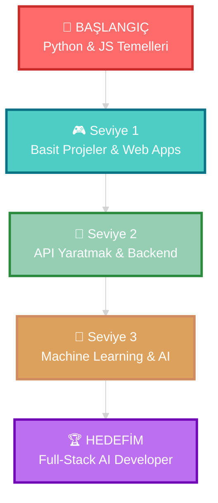

<div align="center">


</div>

<div align="center">
  
#  Hoş Geldin!


<br/>

[](https://www.youtube.com/channel/UCbRYSI8ZHXAZpfIO6qkAipA)
[](mailto:huseynovomer955@gmail.com)
[](https://discord.com)


</div>

<br/>


<br/>

<table>
<tr>
<td width="50%" valign="top">

## 🚀 Hakkımda

```python
class KodSavaşçısı:
    def __init__(self):
        self.isim = "Ömer Hüseynov"
        self.yas = 13
        self.konum = "Bakü, Azerbaycan 🇦🇿"
        self.diller = ["Türkçe", "Azeri", "İngilizce"]
        self.durum = "Öğreniyor ve gelişiyor 📚"
        self.hedef = "Full-Stack AI Developer 🤖"
        self.motto = "Kod yaz, hata al, öğren! 💪"
        self.sevdigim_isler = [
            "💻 Kodlama", 
            "🎮 Oyun oynamak", 
            "📹 Video çekmek",
            "🧠 Yeni teknolojiler öğrenmek"
        ]
    
    def gunluk_rutin(self):
        return {
            "06:00": "🌅 Uyanma ve spor",
            "07:00": "☕ Kahvaltı ve teknoloji araştırması",
            "09:00": "💻 Python ve JavaScript kodlama",
            "12:00": "🍽️ Öğle yemeği ve dinlenme",
            "14:00": "📹 YouTube içeriği hazırlama",
            "16:00": "🎮 Projeler üzerinde çalışma",
            "19:00": "📚 Yeni konseptler öğrenme",
            "22:00": "🌙 Uyku (kodlama rüyalarıyla)"
        }
    
    def uretken_ol(self):
        while self.durum == "Öğreniyor":
            self.ogren()
            self.uygula()
            self.paylas()
            self.gelistir()
        return "🏆 Hedefe ulaşıldı!"

# Kod maceramı başladı! 🚀
ben = KodSavaşçısı()
print(f"Selam! Ben {ben.isim}!")
print("Hadi birlikte kod yazalım! 💻")
```

</td>
<td width="50%" valign="top">

## 💫 Hızlı Bilgiler


🎓 **13 yaşında** profesyonel kod öğreniyorum  
🌱 **Python ve JavaScript** ile başladım  
🎥 **YouTuber** olmaya çalışıyorum  
🎯 **Hedefim:** AI ve Full-Stack Developer  
⚡ **Gerçek:** Her gün yeni bir şey öğreniyorum!  
💭 **İnanç:** Her uzman bir zamanlar yeni başlayan biri idi  
🔥 **Motivasyon:** %200 enerjili  
🎮 **Hobiler:** Oyun, Kod, Video çekme, Teknoloji

<br/>

### 📊 Kod Seviyem

```text
Python         ████░░░░░░   40%
JavaScript     ████░░░░░░   40%
HTML/CSS       █████░░░░░   50%
Git/GitHub     ████░░░░░░   40%
Problem Çözme  ████░░░░░░   45%
API Entegr.    ███░░░░░░░   30%
```

### 🎖️ Başarılarım

✅ İlk Python projesi tamamlandı  
✅ GitHub profili oluşturuldu  
✅ YouTube kanalı açıldı  
🔄 İlk Web uygulaması geliştiriliyor  
🔄 Discord bot hazırlanıyor

</td>
</tr>
</table>

<br/>


<br/>

## 📚 Öğrenme Yol Haritam

<div align="center">



<br/>

### 🎯 Şu Anki Konumum: **Seviye 1-2 arası** 🚀

</div>

<br/>


<br/>

## 🛠️ Teknoloji Yığınım

<div align="center">

### 💻 Şu An Kullandıklarım

<table>
<tr>
<td align="center" width="96">

<br>Python
</td>
<td align="center" width="96">

<br>JavaScript
</td>
<td align="center" width="96">

<br>HTML5
</td>
<td align="center" width="96">

<br>CSS3
</td>
<td align="center" width="96">

<br>VS Code
</td>
<td align="center" width="96">

<br>Git
</td>
<td align="center" width="96">

<br>GitHub
</td>
<td align="center" width="96">

<br>Replit
</td>
</tr>
</table>

### 🎯 Sıradaki Hedeflerim

<table>
<tr>
<td align="center" width="96">

<br>Java
</td>
<td align="center" width="96">

<br>R
</td>
<td align="center" width="96">

<br>C++
</td>
<td align="center" width="96">

<br>JS İleri
</td>
<td align="center" width="96">

<br>Scala
</td>
<td align="center" width="96">

<br>React
</td>
<td align="center" width="96">

<br>Node.js
</td>
<td align="center" width="96">

<br>TensorFlow
</td>
</tr>
</table>

### 🔮 Gelecek Planlarım

<table>
<tr>
<td align="center" width="96">

<br>Docker
</td>
<td align="center" width="96">

<br>Kubernetes
</td>
<td align="center" width="96">

<br>PostgreSQL
</td>
<td align="center" width="96">

<br>MongoDB
</td>
<td align="center" width="96">

<br>Firebase
</td>
<td align="center" width="96">

<br>AWS
</td>
<td align="center" width="96">

<br>Discord.py
</td>
<td align="center" width="96">

<br>ChatGPT API
</td>
</tr>
</table>

</div>

<br/>


<br/>

## 📊 GitHub İstatistiklerim

<div align="center">


</div>

<br/>

<div align="center">

</div>

<br/>

<div align="center">

</div>

<br/>


<br/>

## 🎯 2025 Hedeflerim

<div align="center">

<table>
<tr>
<td width="25%" align="center">

### 📚 Öğrenme
- ✅ Python Temelleri
- ✅ JavaScript Temelleri
- 🔄 OOP Kavramları
- 🔄 Veri Yapıları
- ⏳ Algoritmalar
- ⏳ Java Temelleri
- ⏳ Backend Geliştirme

</td>
<td width="25%" align="center">

### 💻 Projeler
- ✅ Basit Hesap Makinesi
- 🔄 To-Do List Uygulaması
- 🔄 Hava Durumu App (API)
- ⏳ Discord Bot
- ⏳ E-ticaret Sitesi
- ⏳ ChatGPT Entegrasyonu
- ⏳ Portfolio Website

</td>
<td width="25%" align="center">

### 🎥 YouTube
- ✅ Kanal Oluşturma
- 🔄 İlk Videolar
- 🔄 100 Abone
- ⏳ 500 Abone
- ⏳ 1000 Abone
- ⏳ Düzenli İçerik
- ⏳ Canlı Yayınlar

</td>
<td width="25%" align="center">

### 🌟 Kişisel Gelişim
- ✅ GitHub Profili
- 🔄 Kod Portfolyosu
- ⏳ Open Source Katkı
- ⏳ Tech Blog Başlatma
- ⏳ Developer Ağı
- ⏳ Hackathon Katılımı
- ⏳ Online Kurs

</td>
</tr>
</table>

</div>

<br/>


<br/>

## 💡 Projelerim ve Kodlarım

<div align="center">

### 🎉 Başlangıç Projeleri

</div>

<details>
<summary>🌍 Hello World - Her Şey Buradan Başladı!</summary>

```python
# İlk kodum! 🚀
print("Merhaba Dünya! 🌍")
print("Ben Ömer ve programlama öğreniyorum!")
print("Bu yolculuk çok heyecan verici! 💪")
print("Hedefim: Full-Stack AI Developer olmak! 🎯")
```

**Yazdığım tarih:** Ocak 2025  
**Hislerim:** Çok heyecanlıydım! İlk kodumu çalıştırdığımda kendimi süper hissettim! 🎉

</details>

<details>
<summary>🎨 Renkli Terminal - Daha Eğlenceli!</summary>

```python
# Terminal'de renkli yazılar! 🌈
renkler = {
    'kirmizi': '\033[91m',
    'yesil': '\033[92m',
    'sari': '\033[93m',
    'mavi': '\033[94m',
    'mor': '\033[95m',
    'camgobegi': '\033[96m',
    'normal': '\033[0m'
}

print(f"{renkler['kirmizi']}❤️  Kırmızı Yazı")
print(f"{renkler['yesil']}💚 Yeşil Yazı")
print(f"{renkler['sari']}💛 Sarı Yazı")
print(f"{renkler['mavi']}💙 Mavi Yazı")
print(f"{renkler['mor']}💜 Mor Yazı")
print(f"{renkler['camgobegi']}💎 Cam Göbeği Yazı")
print(f"{renkler['normal']}✨ Normal Yazı")
```

**Öğrendiklerim:** ANSI renk kodlarını keşfettim ve terminal tasarımını anladım!

</details>

<details>
<summary>🎲 Sayı Tahmin Oyunu - İlk Gerçek Projem!</summary>

```python
import random

def oyun_baslat():
    print("🎮 SAYI TAHMİN OYUNU 🎮")
    print("=" * 35)
    
    seviye = input("Zorluk seviyesini seç (kolay/orta/zor): ").lower()
    
    if seviye == "kolay":
        max_sayi, max_deneme = 50, 10
    elif seviye == "orta":
        max_sayi, max_deneme = 100, 7
    else:
        max_sayi, max_deneme = 200, 5
    
    sayi = random.randint(1, max_sayi)
    deneme = 0
    
    print(f"\n1 ile {max_sayi} arasında bir sayı tuttum!")
    print(f"Toplam {max_deneme} hakkın var!\n")
    
    while deneme < max_deneme:
        try:
            tahmin = int(input(f"Tahmin {deneme + 1}/{max_deneme}: "))
            deneme += 1
            
            if tahmin < 1 or tahmin > max_sayi:
                print(f"⚠️  Lütfen 1-{max_sayi} arası sayı girin!")
                continue
            
            if tahmin < sayi:
                print("⬆️  Daha yüksek bir sayı söyle!")
            elif tahmin > sayi:
                print("⬇️  Daha düşük bir sayı söyle!")
            else:
                print(f"\n🎉 TEBRİKLER! {deneme} denemede bildin!")
                print(f"🏆 Sayı {sayi} idi!")
                return True
        except ValueError:
            print("❌ Sadece sayı girin!")
    
    print(f"\n😢 Üzgünüm, hakkın bitti!")
    print(f"🔢 Sayı {sayi} idi!")
    return False

if __name__ == "__main__":
    oyun_baslat()
    tekrar = input("\n🔄 Tekrar oynamak ister misin? (evet/hayır): ")
    if tekrar.lower() == "evet":
        oyun_baslat()
    else:
        print("\n✨ Oynadığın için teşekkürler!")
```

**Zorluk:** While döngüsü ve if-else mantığını anlamak zaman aldı ama başardım! 💪

</details>

<details>
<summary>🧮 İnteraktif Hesap Makinesi - Fonksiyonları Öğrendim!</summary>

```python
import math

def topla(a, b):
    return a + b

def cikar(a, b):
    return a - b

def carp(a, b):
    return a * b

def bol(a, b):
    if b == 0:
        return "❌ Sıfıra bölme mümkün değil!"
    return a / b

def us(a, b):
    return a ** b

def kok(a):
    if a < 0:
        return "❌ Negatif sayının kökü olmaz!"
    return math.sqrt(a)

def menu_goster():
    print("\n🧮 İNTERAKTİF HESAP MAKİNESİ 🧮")
    print("=" * 35)
    print("1. Toplama (+)")
    print("2. Çıkarma (-)")
    print("3. Çarpma (*)")
    print("4. Bölme (/)")
    print("5. Üs Alma (^)")
    print("6. Karekök (√)")
    print("0. Çıkış")
    print("=" * 35)

while True:
    menu_goster()
    secim = input("\nİşlemi seç (0-6): ")
    
    if secim == '0':
        print("\n👋 Görüşmek üzere!")
        break
    
    if secim in ['1', '2', '3', '4', '5']:
        try:
            sayi1 = float(input("İlk sayı: "))
            sayi2 = float(input("İkinci sayı: "))
            
            if secim == '1':
                print(f"\n✅ Sonuç: {sayi1} + {sayi2} = {topla(sayi1, sayi2)}")
            elif secim == '2':
                print(f"\n✅ Sonuç: {sayi1} - {sayi2} = {cikar(sayi1, sayi2)}")
            elif secim == '3':
                print(f"\n✅ Sonuç: {sayi1} × {sayi2} = {carp(sayi1, sayi2)}")
            elif secim == '4':
                print(f"\n✅ Sonuç: {sayi1} ÷ {sayi2} = {bol(sayi1, sayi2)}")
            elif secim == '5':
                print(f"\n✅ Sonuç: {sayi1}^{sayi2} = {us(sayi1, sayi2)}")
        except ValueError:
            print("\n❌ Sadece sayı girin!")
    
    elif secim == '6':
        try:
            sayi = float(input("Sayı girin: "))
            print(f"\n✅ Sonuç: √{sayi} = {kok(sayi)}")
        except ValueError:
            print("\n❌ Sadece sayı girin!")
    
    else:
        print("\n❌ Yanlış seçim! Lütfen 0-6 arası seçin.")
    
    devam = input("\nDevam etmek için Enter'a basın...")
```

**Başarı:** İlk kez fonksiyon yazdım! Kodlarım daha düzenli görünüyor! 🎯

</details>

<br/>


<br/>

## 📺 YouTube Yolculuğum

<div align="center">

<a href="https://www.youtube.com/channel/UCbRYSI8ZHXAZpfIO6qkAipA">

</a>

<br/><br/>

### 🎬 İçerik Planım

| 📹 Video Türü | 📝 Açıklama | ✅ Durum |
|:---:|:---|:---:|
| 🚀 Başlangıç | Python ve JS'e nasıl başladım | Planlanıyor |
| 💻 Beraber Kod | Benimle birlikte kod yaz | Planlanıyor |
| 🐛 Hata Çözümleri | Yaptığım hatalar ve çözümleri | Planlanıyor |
| 🎮 Proje Videoları | Hazırladığım projeleri gösterme | Planlanıyor |
| 🤖 AI Keşifleri | ChatGPT ve AI araçları | Planlanıyor |
| 📚 Ders Serisi | Python sıfırdan master seviye | Planlanıyor |

### 💭 *"Her video, öğrenme yolculuğumun bir parçası!"*

</div>

<br/>


<br/>

## 🌟 İlham Verici Sözler

<div align="center">

<table>
<tr>
<td>

### 💡 Beni Motive Edenler

> *"Yeni bir programlama dilini öğrenmenin tek yolu, o dilde programlar yazmaktır."*  
> **— Dennis Ritchie**

> *"Kod mizah gibidir. Açıklaması gerekiyorsa, kötüdür."*  
> **— Cory House**

> *"Önce problemi çöz. Sonra kodu yaz."*  
> **— John Johnson**

> *"En iyi hata mesajı, hiç gösterilmeyendir."*  
> **— Thomas Fuchs**

</td>
<td>

### 🎯 Benim Mottoм

```python
while True:
    kod_yaz()
    hata_al()
    ogren()
    
    if basarili():
        kutla()
    else:
        yeniden_dene()
    
    # Asla vazgeçme! 💪
```

**🔥 İnanç:**  
Her hata, bir öğrenme fırsatıdır!  
Her başarısız deneme, başarıya bir adım daha yaklaşmaktır!

</td>
</tr>
</table>

</div>

<br/>


<br/>

## 📫 Benimle İletişime Geç!

<div align="center">

### 🤝 Birlikte Öğrenelim!

<table>
<tr>
<td align="center" width="200">
<a href="https://www.youtube.com/channel/UCbRYSI8ZHXAZpfIO6qkAipA">
<br/>
<b>YouTube</b><br/>
<sub>Videoları izle</sub>
</a>
</td>
<td align="center" width="200">
<a href="mailto:huseynovomer955@gmail.com">
<br/>
<b>Gmail</b><br/>
<sub>Email gönder</sub>
</a>
</td>
<td align="center" width="200">
<a href="https://discord.com">
<br/>
<b>Discord</b><br/>
<sub>Sohbet et</sub>
</a>
</td>
<td align="center" width="200">
<a href="https://github.com/Lukosadev1">
<br/>
<b>GitHub</b><br/>
<sub>Kodları incele</sub>
</a>
</td>
</tr>
</table>

<br/>

### 💬 Mesaj Gönder

[](https://www.youtube.com/channel/UCbRYSI8ZHXAZpfIO6qkAipA)
[](mailto:huseynovomer955@gmail.com)
[](https://discord.com)

<br/>

**💡 Soru, öneri veya sadece sohbet için her zaman açığım!**

</div>

<br/>


<br/>

<div align="center">

## 🎓 Öğrenme Kaynaklarım

*Eğer sen de öğreniyorsan, bunlar çok işime yarıyor:*

[](https://python.org)
[](https://w3schools.com)
[](https://developer.mozilla.org)
[](https://stackoverflow.com)
[](https://chat.openai.com)
[](https://youtube.com)
[](https://freecodecamp.org)
[](https://github.com)

</div>

<br/>


<br/>

<div align="center">

## 🏆 Öğrenme Kilometre Taşları

<table>
<tr>
<td align="center" width="25%">

### 📅 Ocak 2025
✅ İlk Python kodu  
✅ Git öğrenmeye başladım  
✅ GitHub hesabı açtım  
✅ İlk hesap makinesi

</td>
<td align="center" width="25%">

### 🎯 Şubat 2025
🔄 JavaScript öğreniyorum  
🔄 İlk web projesi  
⏳ HTML/CSS master  
⏳ İlk GitHub repo

</td>
<td align="center" width="25%">

### 🚀 Mart 2025
⏳ API kullanımı  
⏳ Backend temelleri  
⏳ Database öğrenme  
⏳ Discord bot projesi

</td>
<td align="center" width="25%">

### 💫 İleride
⏳ Java öğrenme  
⏳ AI projeleri  
⏳ Full-stack proje  
⏳ İlk freelance iş

</td>
</tr>
</table>

</div>

<br/>


<br/>

<div align="center">

## 💼 Proje Vitrini

### 🎨 Yakında Gelecek Projeler

<table>
<tr>
<td align="center" width="33%">

### 🌦️ Hava Durumu Uygulaması
**Durum:** Geliştiriliyor 🔄  
**Teknolojiler:** Python, API, Tkinter  
**Özellikler:**
- Gerçek zamanlı hava durumu
- 7 günlük tahmin
- Şehir arama
- Görsel grafikler

</td>
<td align="center" width="33%">

### 📝 To-Do List Web App
**Durum:** Planlanıyor ⏳  
**Teknolojiler:** HTML, CSS, JavaScript  
**Özellikler:**
- Görev ekleme/silme
- Tamamlanma takibi
- Öncelik seviyeleri
- Local storage

</td>
<td align="center" width="33%">

### 🤖 Discord Bot
**Durum:** Planlanıyor ⏳  
**Teknolojiler:** Python, Discord.py  
**Özellikler:**
- Moderasyon komutları
- Müzik çalma
- Mini oyunlar
- AI entegrasyonu

</td>
</tr>
</table>

</div>

<br/>


<br/>

<div align="center">

## 🌈 Yolculuğuma Katıl!


### ✨ *Henüz başlangıçtayım ama azimle devam ediyorum!*

**13 yaşında, sınırsız potansiyelle! 🚀**

<br/>

### 📈 Profil İstatistikleri


<br/>

### 🎯 Son Güncelleme: Ocak 2025

**⭐ Bu profili beğendiysen yıldız vermeyi unutma!**  
**🔔 Takip et ve yolculuğumu izle!**  
**💬 Geri bildirimlerine açığım!**

<br/>

---

<sub>💖 Sevgiyle kodlanmıştır | 🚀 Yapımda: Ömer Hüseynov | ⚡ Sürekli Gelişiyor</sub>

<br/>

### 🎊 Teşekkürler!

*Bu profili ziyaret ettiğin için teşekkür ederim! Eğer benimle aynı yolculuktaysan, birlikte öğrenelim ve büyüyelim! 💪*

</div>


