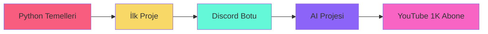

<div align="center">

#  Selam, Ben Ömer!


<br/>

[](https://www.youtube.com/channel/UCbRYSI8ZHXAZpfIO6qkAipA)
[](mailto:huseynovomer955@gmail.com)
[](https://discord.com)


</div>

<br/>


## 🚀 Hakkımda

```python
class Omer:
    def __init__(self):
        self.yas = 13
        self.konum = "Baku 🇦🇿"
        self.durum = "Öğreniyorum 📚"
        self.tutkular = ["Yapay Zeka", "Python", "Kodlama"]
    
    def gunluk_rutinim(self):
        while True:
            self.kod_yaz()
            self.hata_al()
            self.ogren()
            self.tekrarla()
```

<br clear="right"/>

🌱 Python ile kodlamaya yeni başladım ve her gün biraz daha ilerliyorum  
🎥 YouTube'da öğrenme sürecimi paylaşıyorum  
🎯 Hedefim: Havalı AI projeleri yapmak  
💭 Motto: "Kod yaz, hata al, öğren, tekrarla"

---

## 📚 Şu An Neler Yapıyorum?

<div align="center">

| 🎓 Öğreniyorum | 🎯 Planlıyorum |
|:---:|:---:|
| Python Temelleri | ChatGPT API |
| VS Code Kullanımı | Discord Botları |
| Git & GitHub | Basit Oyunlar |
| Programlama Mantığı | AI Projeleri |

</div>

---

## 🛠️ Teknolojiler & Araçlar

<div align="center">

### Diller


### Araçlar


### Öğrenmeye Başlayacağım


</div>

---

## 📊 GitHub İstatistiklerim

<div align="center">
  
  
</div>

<div align="center">
  
</div>

---

## 🎯 2025 Hedeflerim

<div align="center">



</div>

- 🐍 **Python temellerini** sağlamlaştırmak
- 🎮 **İlk basit projeyi** tamamlamak
- 🤖 **ChatGPT API** ile bir şeyler yapmak
- 🎵 **Discord music bot** denemek
- 📹 **YouTube'da** düzenli içerik paylaşmak
- 🤝 Kod yazarken **eğlenmek ve öğrenmek**!

---

## 💡 Öğrenme Yolculuğum

<div align="center">


> ### ✨ *"Her uzman bir zamanlar acemiydi."*
> 
> Kodlamaya yeni başladım ve her gün yeni şeyler öğreniyorum.  
> Bazen hatalar yapıyorum, bazen kod çalışmıyor ama bu da öğrenmenin bir parçası! 😄
> 
> **YouTube kanalımda** bu süreçteki gelişimimi, küçük başarılarımı ve  
> karşılaştığım zorlukları paylaşıyorum. Sen de öğreniyorsan, birlikte ilerleyelim! 🚀

</div>

---

## 🎨 Kod Snippet'lerim

<details>
<summary>🐍 İlk Python Kodum</summary>

```python
# Herkesin başladığı yer!
print("Merhaba Dünya! 🌍")
print("Ben Ömer ve kodlamayı öğreniyorum!")
```

</details>

<details>
<summary>🎲 Basit Sayı Tahmin Oyunu</summary>

```python
import random

sayi = random.randint(1, 100)
tahmin = 0

while tahmin != sayi:
    tahmin = int(input("Bir sayı tahmin et (1-100): "))
    if tahmin < sayi:
        print("Daha yüksek! ⬆️")
    elif tahmin > sayi:
        print("Daha düşük! ⬇️")
    else:
        print("Tebrikler! Bildin! 🎉")
```

</details>

---

## 📺 YouTube İçeriklerim

<div align="center">

[](https://www.youtube.com/channel/UCbRYSI8ZHXAZpfIO6qkAipA)

**📹 İçerikler:**
- Python öğrenme süreci
- Yaptığım küçük projeler
- Karşılaştığım hatalar ve çözümler
- AI ve kodlama hakkında keşifler

</div>

---

## 📫 Benimle İletişime Geç

<div align="center">

<a href="https://www.youtube.com/channel/UCbRYSI8ZHXAZpfIO6qkAipA">
  
</a>
<a href="mailto:huseynovomer955@gmail.com">
  
</a>
<a href="https://discord.com">
  
</a>

</div>

---

<div align="center">

### 🌟 *Yeni başlıyorum ama azimle devam ediyorum!*


**⭐ Bu profili beğendiysen yıldız vermeyi unutma!**


</div>
