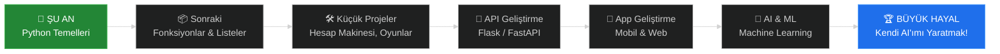

<div align="center">


</div>

---

<div align="center">


<br/>

[](https://www.youtube.com/channel/UCbRYSI8ZHXAZpfIO6qkAipA)
[](mailto:huseynovomer955@gmail.com)
[](https://discord.com)
[](https://github.com/Lukosadev1)


</div>

---

## 👋 Merhaba, Ben Ömer!

```python
class OmerHuseynov:
    ad       = "Ömer Hüseynov"
    yas      = 13
    sehir    = "Bakü, Azerbaycan 🇦🇿"
    seviye   = "Yeni Başlayan — ama çok hevesli! 🔥"

    su_an_ogreniyor = ["Python temelleri", "Değişkenler", "if-else", "Döngüler"]

    hedefler = [
        "🤖 Kendi yapay zekamı yaratmak",
        "🔗 Kendi API'mi yazmak ve yayımlamak",
        "📱 Mobil uygulama geliştirmek",
        "🌐 Web uygulamaları yapmak",
        "🧠 Machine Learning öğrenmek"
    ]

    def motivasyon(self):
        return "Bilgim az ama motivasyonum %1000! 💪"
```

---

## 📊 Dürüst Beceri Seviyem

| Teknoloji | Seviye | İlerleme |
|-----------|--------|----------|
| Python | Yeni Başladım | `██░░░░░░░░` 15% |
| HTML / CSS | Temel Şeyler | `██░░░░░░░░` 20% |
| JavaScript | Çok Az | `█░░░░░░░░░` 5% |
| Git / GitHub | Öğreniyorum | `█░░░░░░░░░` 10% |
| AI / ML | Henüz Başlamadım | `░░░░░░░░░░` 0% — yakında! |

---

## 🗺️ Öğrenme Yolculuğum


```mermaid
%%{init: {'theme':'dark', 'themeVariables': {'primaryColor':'#1f6feb','edgeLabelBackground':'#0d1117'}}}%%
flowchart LR
    A["🌱 ŞU AN\nPython Temelleri"] --> B["📦 Sonraki\nFonksiyonlar & Listeler"]
    B --> C["🛠️ Küçük Projeler\nHesap Makinesi, Oyunlar"]
    C --> D["🔗 API Geliştirme\nFlask / FastAPI"]
    D --> E["📱 App Geliştirme\nMobil & Web"]
    E --> F["🧠 AI & ML\nMachine Learning"]
    F --> G["🏆 BÜYÜK HAYAL\nKendi AI'ımı Yaratmak!"]

    style A fill:#238636,color:#fff,stroke:#3fb950
    style G fill:#1f6feb,color:#fff,stroke:#58a6ff
```

---

## 🛠️ Şu An Kullandığım Araçlar

<div align="center">


</div>

## 🎯 Öğrenmek İstediklerim

<div align="center">


</div>

---

## 💻 İlk Kodlarım

<details>
<summary><b>🌍 Hello World — İlk Kodum! (Ocak 2025)</b></summary>

```python
# Hayatımda yazdığım ilk kod! 🚀
print("Merhaba Dünya!")
print("Ben Ömer, 13 yaşındayım.")
print("Kodlamayı öğrenmeye başladım!")
```
> Çalıştığında inanamadım! En mutlu anlarımdan biri oldu. 🎉

</details>

<details>
<summary><b>➕ İlk Değişken ve Toplama Programım</b></summary>

```python
sayi1 = 5
sayi2 = 3
toplam = sayi1 + sayi2

print("İlk sayı:", sayi1)
print("İkinci sayı:", sayi2)
print("Toplam:", toplam)
```
> Değişkenlerin nasıl çalıştığını anladığım an! 💡

</details>

<details>
<summary><b>🎯 İlk if-else Kodum</b></summary>

```python
yas = 13

if yas < 18:
    print("Henüz çocuğum — ama çok şey öğreneceğim!")
else:
    print("Yetişkinim.")

print("Yaşım:", yas)
```
> if-else'i anlamak biraz zaman aldı, ama bunu anlayınca çok mutlu oldum!

</details>

<details>
<summary><b>🔢 Basit Hesap Makinesi (Üzerinde Çalışıyorum)</b></summary>

```python
print("=== Basit Hesap Makinesi ===")
print("1. Toplama")
print("2. Çıkarma")

secim = input("Seçiminiz (1/2): ")
sayi1 = float(input("1. Sayı: "))
sayi2 = float(input("2. Sayı: "))

if secim == "1":
    print("Sonuç:", sayi1 + sayi2)
elif secim == "2":
    print("Sonuç:", sayi1 - sayi2)
else:
    print("Geçersiz seçim!")
```
> Hâlâ geliştiriyorum — bazen hata veriyor, ama öğreniyorum! 💪

</details>

---

## ✅ 2025 Hedeflerim

### Öğrenme
- [x] Python'a başladım
- [x] print, değişkenler, if-else öğrendim
- [ ] Döngüler (for, while)
- [ ] Fonksiyonlar ve listeler
- [ ] Python temellerini bitir

### Projeler
- [x] Hello World yazdım
- [ ] Hesap makinesi tamamla
- [ ] Sayı tahmin oyunu yap
- [ ] İlk GitHub projesini paylaş

### API & Uygulama
- [ ] Flask veya FastAPI öğren
- [ ] Basit bir API yaz
- [ ] Kendi API'mi yayınla
- [ ] Web / Mobil app yap

### Yapay Zeka
- [ ] AI temellerini öğren
- [ ] Machine Learning'e başla
- [ ] İlk AI projesini yap
- [ ] **Kendi AI'ımı yarat! 🤖**

---

## 📺 YouTube Kanalım

<div align="center">

[](https://www.youtube.com/channel/UCbRYSI8ZHXAZpfIO6qkAipA)

| Video | İçerik | Durum |
|-------|--------|-------|
| 🚀 Başlangıç | Kodlamaya nasıl başladım | Hazır |
| 📚 Python Serisi | Öğrenme yolculuğum | Planlanıyor |
| 🐛 Hatalarım | Hatalar ve çözümler | Planlanıyor |
| 💻 Kod Along | Benimle birlikte öğren | Planlanıyor |
| 🤖 AI Serisi | Yapay zekaya giden yolum | İleride |

> *"Her hatam bir video konusu olabilir!"* 😄

</div>

---

## 📚 Öğrendiğim Kaynaklar

<div align="center">

[](https://youtube.com)
[](https://w3schools.com)
[](https://python.org)
[](https://chat.openai.com)

</div>

---

<div align="center">

## 💬 Son Sözler

**Evet, henüz çok şey bilmiyorum.**
**Ama her gün biraz daha ilerliyorum.**
**Ve bir gün kendi yapay zekamı yaratacağım. 🤖**

<br/>

*Sen de yeni başlıyorsan — birlikte öğrenelim!*
*Herkes bir yerden başladı. Ben de şimdi başlıyorum. 💪*

<br/>


</div>


