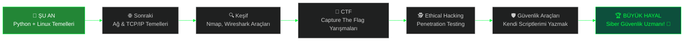

<div align="center">


</div>

---

<div align="center">


<br/>

[](https://www.youtube.com/channel/UCbRYSI8ZHXAZpfIO6qkAipA)
[](mailto:huseynovomer955@gmail.com)
[](https://discord.com)
[](https://github.com/Lukosadev1)


</div>

---

## 🔐 Merhaba, Ben Ömer!

```python
class OmerHuseynov:
    ad       = "Ömer Hüseynov"
    yas      = 14
    sehir    = "Bakü, Azerbaycan 🇦🇿"
    seviye   = "Junior Hacker — ama çok hevesli! 🔥"
    mod      = "ÖĞRENME MODU AKTİF ✅"

    su_an_ogreniyor = [
        "Python temelleri 🐍",
        "Linux komutları 🐧",
        "Ağ temelleri (TCP/IP) 🌐",
        "CTF (Capture The Flag) 🚩"
    ]

    hedefler = [
        "🔐 Siber Güvenlik Uzmanı olmak",
        "🕵️ Ethical Hacking öğrenmek",
        "🛡️ Kendi güvenlik araçlarımı yazmak",
        "🚩 CTF yarışmalarına katılmak",
        "🧠 Penetration Testing yapmak"
    ]

    def motivasyon(self):
        return "Bilgim az ama merakım sonsuz! 💪"
```

---

## 📊 Dürüst Beceri Seviyem

| Teknoloji | Seviye | İlerleme |
|-----------|--------|----------|
| Python | Yeni Başladım | `██░░░░░░░░` 15% |
| Linux / Terminal | Temel Komutlar | `██░░░░░░░░` 20% |
| Ağ Temelleri | Öğreniyorum | `█░░░░░░░░░` 10% |
| HTML / CSS | Biraz Biliyorum | `██░░░░░░░░` 20% |
| Kriptografi | Henüz Başlamadım | `░░░░░░░░░░` 0% — yakında! |
| CTF / Ethical Hacking | Henüz Başlamadım | `░░░░░░░░░░` 0% — hedefimde! |

---

## 🗺️ Siber Güvenlik Yolculuğum


```mermaid
%%{init: {'theme':'dark', 'themeVariables': {'primaryColor':'#00ff41','edgeLabelBackground':'#0d1117','lineColor':'#00ff41'}}}%%
flowchart LR
    A["🌱 ŞU AN\nPython + Linux Temelleri"] --> B["🌐 Sonraki\nAğ & TCP/IP Temelleri"]
    B --> C["🔍 Keşif\nNmap, Wireshark Araçları"]
    C --> D["🚩 CTF\nCapture The Flag Yarışmaları"]
    D --> E["🕵️ Ethical Hacking\nPenetration Testing"]
    E --> F["🛡️ Güvenlik Araçları\nKendi Scriptlerimi Yazmak"]
    F --> G["🏆 BÜYÜK HAYAL\nSiber Güvenlik Uzmanı! 🔐"]

    style A fill:#238636,color:#fff,stroke:#00ff41
    style G fill:#0d4f3c,color:#00ff41,stroke:#00ff41
```

---

## 🛠️ Şu An Kullandığım Araçlar

<div align="center">


</div>

## 🎯 Öğrenmek İstediğim Siber Güvenlik Araçları

<div align="center">


</div>

---

## 💻 İlk Güvenlik Kodlarım

<details>
<summary><b>🌍 Hello World — İlk Kodum! (Ocak 2025)</b></summary>

```python
# Hayatımda yazdığım ilk kod! 🚀
print("Merhaba Dünya!")
print("Ben Ömer, 14 yaşındayım.")
print("Siber güvenlik uzmanı olmak istiyorum!")
```
> Çalıştığında inanamadım! En mutlu anlarımdan biri oldu. 🎉

</details>

<details>
<summary><b>🔐 Basit Şifre Gücü Kontrol Programım</b></summary>

```python
sifre = input("Şifreni gir: ")
guc = 0

if len(sifre) >= 8:
    guc += 1
    print("✅ Yeterli uzunluk")
else:
    print("❌ Çok kısa!")

if any(c.isupper() for c in sifre):
    guc += 1
    print("✅ Büyük harf var")

if any(c.isdigit() for c in sifre):
    guc += 1
    print("✅ Sayı var")

if guc == 3:
    print("🔐 Güçlü şifre!")
else:
    print("⚠️ Şifreni güçlendir!")
```
> Güvenlik araçlarına olan ilk adımım! 🔒

</details>

<details>
<summary><b>🎯 İlk if-else Kodum</b></summary>

```python
yas = 14

if yas < 18:
    print("Henüz gencim — ama en iyi hackerlar genç yaşta başladı!")
else:
    print("Yetişkinim.")

print("Hedef: Ethical Hacker olmak! 🕵️")
```
> if-else'i anlamak biraz zaman aldı ama şimdi çok işime yarıyor!

</details>

<details>
<summary><b>🔢 Basit Şifreleme Deneyi (XOR) — Üzerinde Çalışıyorum</b></summary>

```python
# Basit XOR şifreleme — kriptografiye ilk adım!
mesaj = "OMER"
anahtar = 42

sifreli = ""
for harf in mesaj:
    sifreli += chr(ord(harf) ^ anahtar)

print("Şifreli mesaj:", sifreli)

# Çözme
cozulmus = ""
for harf in sifreli:
    cozulmus += chr(ord(harf) ^ anahtar)

print("Çözülmüş mesaj:", cozulmus)
```
> Kriptografi çok ilginç — daha çok öğreneceğim! 🔓

</details>

---

## ✅ 2026 Hedeflerim

### Temel Beceriler
- [x] Python'a başladım
- [x] print, değişkenler, if-else öğrendim
- [ ] Döngüler ve fonksiyonlar
- [ ] Linux terminal komutları
- [ ] Ağ temelleri (IP, TCP/UDP, DNS)

### Siber Güvenlik
- [ ] TryHackMe'ye kayıt ol
- [ ] İlk CTF yarışmasına katıl 🚩
- [ ] Nmap ile ağ tarama öğren
- [ ] Wireshark ile paket analizi yap
- [ ] Kali Linux kur ve kullan

### Projeler
- [x] Hello World yazdım
- [ ] Şifre gücü kontrol aracı tamamla
- [ ] Port tarayıcı yaz (Python ile)
- [ ] İlk GitHub güvenlik projesini paylaş

### Yapay Zeka & Güvenlik
- [ ] AI destekli güvenlik araçlarını araştır
- [ ] Machine Learning ile anomali tespiti öğren
- [ ] **Kendi siber güvenlik aracımı yaz! 🛡️**

---

## 🏆 Hedeflediğim Sertifikalar (İleride!)

<div align="center">

| Sertifika | Kurum | Durum |
|-----------|-------|-------|
| CompTIA Security+ | CompTIA | 🎯 Hedefte |
| CEH (Ethical Hacker) | EC-Council | 🎯 Hedefte |
| eJPT | eLearnSecurity | 🎯 Başlangıç |
| OSCP | Offensive Security | 🌟 Büyük Hayal |

</div>

---

## 📺 YouTube Kanalım

<div align="center">

[](https://www.youtube.com/channel/UCbRYSI8ZHXAZpfIO6qkAipA)

| Video | İçerik | Durum |
|-------|--------|-------|
| 🚀 Başlangıç | Siber güvenliğe nasıl başladım | Hazır |
| 🐧 Linux Serisi | Terminal komutları öğreniyorum | Planlanıyor |
| 🚩 CTF Çözümleri | Birlikte çözelim | Planlanıyor |
| 🐍 Python Güvenlik | Güvenlik araçları yazıyorum | Planlanıyor |
| 🕵️ Hacking Serisi | Ethical hacking yolculuğum | İleride |

> *"Her CTF çözümü bir video konusu olabilir!"* 😄

</div>

---

## 📚 Öğrendiğim Kaynaklar

<div align="center">

[](https://tryhackme.com)
[](https://youtube.com)
[](https://hackthebox.com)
[](https://python.org)
[](https://chat.openai.com)

</div>

---

<div align="center">

## 💬 Son Sözler

**Evet, henüz çok şey bilmiyorum.**
**Ama her gün sistemleri biraz daha anlıyorum.**
**Ve bir gün dünyanın en iyi ethical hackerlarından biri olacağım. 🔐**

<br/>

*Sen de siber güvenliğe merak duyuyorsan — birlikte öğrenelim!*
*En iyi hackerlar da bir zamanlar "Hello World" yazdı. 💪*

<br/>


</div>


